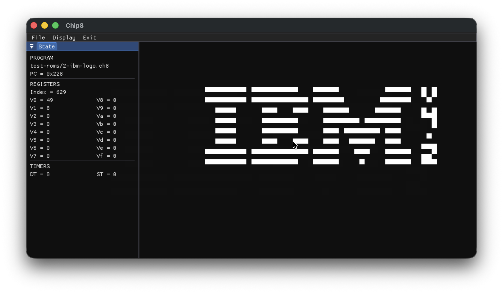
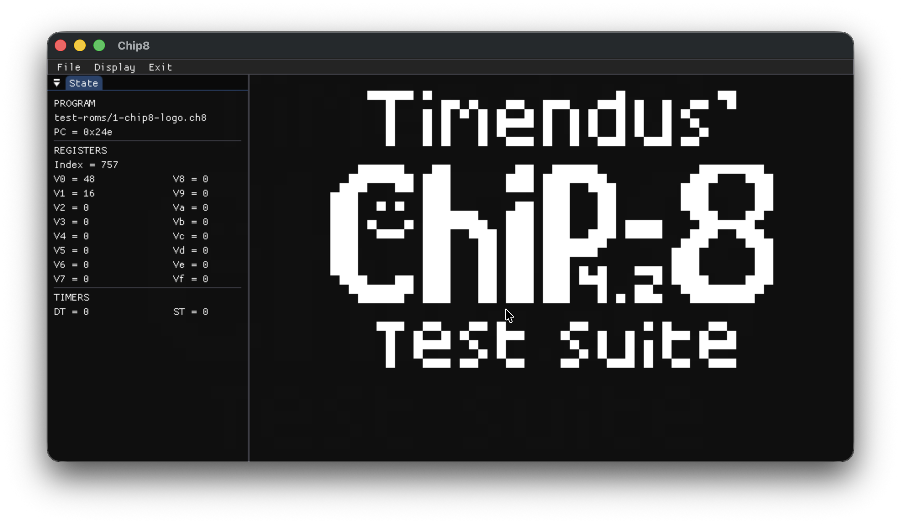
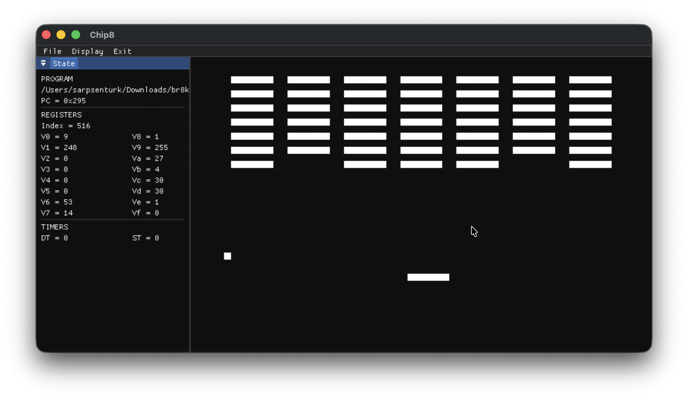

# CHIP-8

A CHIP-8 interpreter written in modern C++20 using SDL3.

The project implements the complete original CHIP-8 instruction set and aims to provide accurate behavior while maintaining a clean, modern, and easy-to-read codebase.

## Features

* Complete original CHIP-8 instruction set
* Original CHIP-8 quirks implemented
* Delay and sound timers
* Keyboard input mapped to the CHIP-8 keypad
* ROM loading
* SDL3-based renderer with configurable display scaling
* Cross-platform (Windows, Linux, and macOS)
* Modern C++20 codebase
* CMake build system

## Building

### Requirements

* C++20 compatible compiler
* SDL 3.4.12
* CMake

Build the project:

```bash
cmake -S . -B build
cmake --build build
```

## Running

```bash
./build/chip8 [rom]
```

Where:

* `rom` is the path to a CHIP-8 ROM.

Example:

```bash
./build/chip8 test-roms/1-chip8-logo.ch8
```

## Compatibility

The interpreter has been verified against Timendus' CHIP-8 test suite and currently passes the following test ROMs:

| Test ROM                 | Status |
| ------------------------ | ------ |
| chip8-logo.ch8           | ✅      |
| ibm-logo.ch8             | ✅      |
| corax+.ch8               | ✅      |
| flags.ch8                | ✅      |
| quirks.ch8 (CHIP-8 mode) | ✅      |
| keypad.ch8               | ✅      |

## Screenshots





